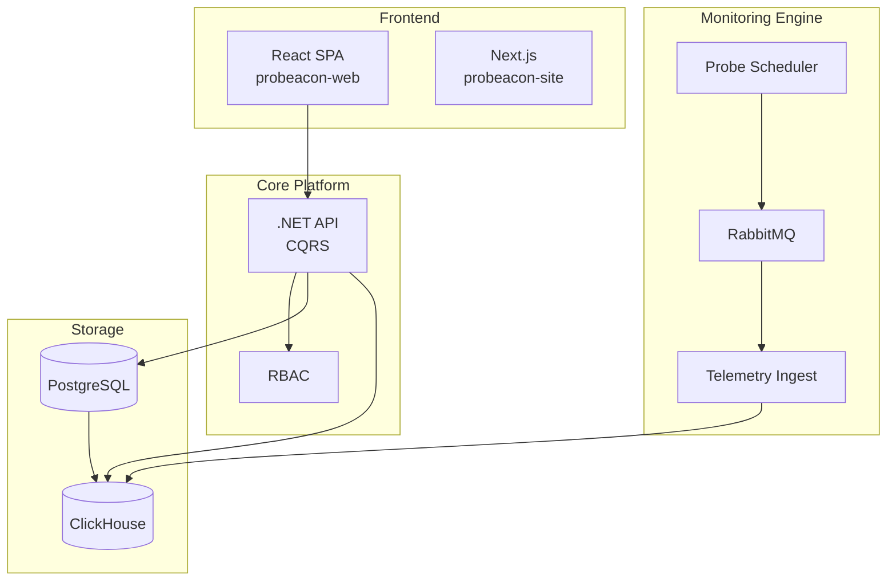

# ProBeacon — Architecture & Build Plan

> A self-hosted-style uptime & service monitoring platform with project-based organization, multi-tenancy, and role/tool-based access control. Think "Uptime Kuma, but multi-tenant, project-aware, and access-controlled."

---

## 1. Why ProBeacon (Differentiators vs. Uptime Kuma)

Uptime Kuma is a single-tier, single-user-ish tool (Node.js + SQLite, one container). ProBeacon improves on it with:

- **Project-based probes** — probes are grouped under projects, not a flat list.
- **Tool / role-based access control (RBAC)** — fine-grained permissions per user per project.
- **Multi-tenancy** — multiple isolated customers/orgs on one hosted platform.
- **Scalable time-series storage** — built to handle large volumes of check results.

---

## 2. High-Level Architecture

ProBeacon uses **CQRS** to separate the write side (config/rules) from the read/ingest side (monitoring telemetry).



---

## 3. Tech Stack

| Layer | Technology | Purpose |
|---|---|---|
| Dashboard (SPA) | **React + Vite** | Authenticated dashboard — projects, probes, RBAC management |
| Marketing site | **Next.js** | Public-facing landing/promotional site |
| API (write + read) | **.NET API** | CQRS commands/queries for projects, rules, tenants, auth |
| Scheduler / Checker | **.NET Worker Service** | Repeatedly executes probe checks (HTTP, TCP, ping, etc.) |
| Messaging | **RabbitMQ + MassTransit** | Decouples check execution from storage; absorbs spikes |
| Relational DB | **PostgreSQL** | Tenants, users, projects, rules, monitors config, billing |
| Time-series DB | **ClickHouse** | High-volume monitor check results & metrics |

### Why ClickHouse for telemetry?
ClickHouse is a columnar database built for real-time analytics over huge datasets. It compresses heavily and queries billions of rows fast — ideal for monitoring history, uptime graphs, and aggregations. PostgreSQL *can* store time-series, but ClickHouse scales far better for this workload. Both are free and open source, and both run easily in Docker.

### Why a message queue instead of writing directly to ClickHouse?
- **Decoupling** — check logic doesn't depend on the DB being available.
- **Resilience** — if ClickHouse is down, results stay queued instead of lost.
- **Spike handling** — bursts of checks get buffered, not dropped.

---

## 4. Data Model (PostgreSQL — relational side)

Core entities to build first:

- **Tenant** — the org/customer (root of isolation).
- **User** — belongs to a tenant; has auth credentials.
- **Role / Permission** — RBAC definitions (tool-based access control).
- **Project** — a container that groups monitors; belongs to a tenant.
- **Probe** — a single check definition (URL/host, type, interval), belongs to a project.
- **Rule** — alerting/notification conditions tied to monitors.
- **Subscription / Plan** — tier and usage limits for the tenant.

ClickHouse stores the **check results** (timestamp, probe_id, status, response_time, status_code, etc.) — not config.

---

## 5. Multi-Tenancy

- Enforce **tenant isolation** in the API — every query is scoped to the tenant.
- Each tenant manages their own users, projects, and probes independently.

---

## 6. Build Order (Recommended Roadmap)

### Phase 1 — Foundations (relational core)
1. Set up the .NET API project with CQRS structure (commands + queries).
2. PostgreSQL schema: Tenants, Users, Roles/Permissions.
3. Sign-up / login / auth flow.
4. Projects CRUD (with tenant scoping).
5. Rules CRUD.
6. RBAC enforcement on every endpoint.

### Phase 2 — Monitoring entities
7. Probe entity + CRUD, linked to projects.
8. Basic React SPA dashboard to manage projects & probes.

### Phase 3 — The actual monitoring engine
10. .NET Worker Service that schedules and fires probe checks repeatedly.
11. Worker publishes probe results as events to RabbitMQ (via MassTransit).
12. Consumer service reads events and writes to ClickHouse.
13. Query side: API reads telemetry from ClickHouse for the dashboard.

### Phase 4 — Polish
14. Alerting/notifications driven by Rules.
15. Public/shareable status pages.
16. Self-host packaging (Docker Compose for the full stack).

---

## 7. Suggested Repo / Service Layout

```
probeacon/
├── probeacon-web/            # React SPA (Vite) — authenticated dashboard
├── probeacon-site/           # Next.js — public marketing/landing site
├── ProBeacon.Api/            # .NET API (CQRS commands & queries)
├── ProBeacon.Worker/         # .NET Worker Service (scheduler/checker)
├── ProBeacon.Ingest/         # Consumer: queue → ClickHouse
├── ProBeacon.Domain/         # Shared domain models / contracts
├── ProBeacon.Infrastructure/ # EF Core, ClickHouse client, MassTransit config
└── docker-compose.yml     # postgres, clickhouse, rabbitmq, services
```

---

## 8. Next Step

Start with **Phase 1**. Get a tenant + user + project + auth working with CQRS against PostgreSQL before touching the worker, queue, or ClickHouse. A solid data model and access layer first makes everything after it much easier.
